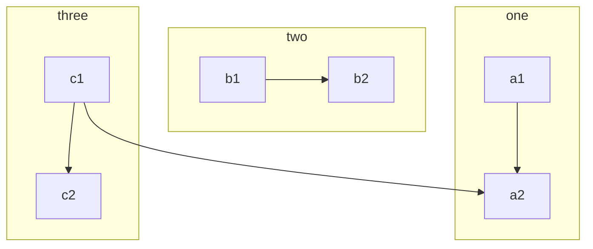

# @jwevans/markdown-it-mermaid

## Usage

```
npm i --save @jwevans/markdown-it-mermaid
```

```typescript
import MarkdownIt from 'markdown-it';
import MarkdownItMermaid from '@jwevans/markdown-it-mermaid';

const md = new MarkdownIt();

md.use(MarkdownItMermaid);

md.render(/* Markdown String to Render */)
```

## Examples

~~~markdown



~~~

In the outputed HTML include the following: (or the latest version from https://mermaid-js.github.io/mermaid/#/n00b-gettingStarted?id=_3-calling-the-javascript-api)

```html
<script src="https://cdn.jsdelivr.net/npm/mermaid/dist/mermaid.min.js"></script>
<script>
   mermaid.initialize({ startOnLoad: true });
</script>
```